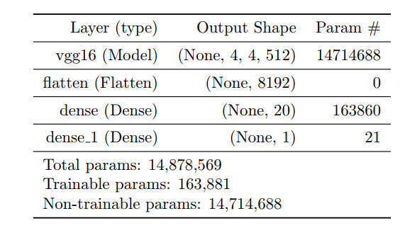
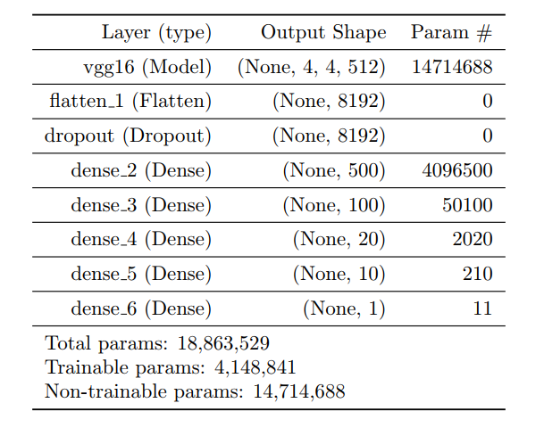
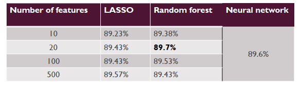
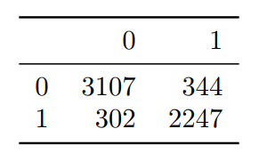
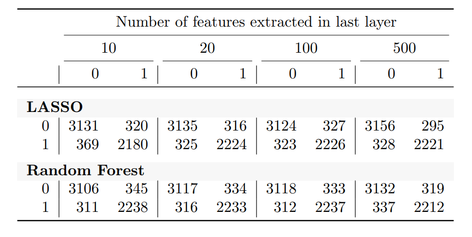

# Neural-Network-Feature-Extraction
Image Recognition using a convolutional base from VGG-16, extracting features from final layers as input for LASSO and Random Forest algorithms. 

> Authors: Emil Westin, Hongru Zhai, Christoffer Eriksson (2020)

## Abstract
In this study, we decided to do image recognition on the celebrity data set [[1]](#1) by training neural networks to classify an image as male or female.
We trained various NN:s using the convolutional base from VGG-16 [[2]](#2), extracted features from all the dense layers in our final model, trained LASSO- and random forest models based on those extracted features to see if we could beat our best performed network, or if we could see something interesting with this approach.

Our results indicate that the LASSO and random forest models with its input features extracted from our trained neural network have very similar performance on the test data as our trained neural network, around 89%. The model that had the highest accuracy on the test set
was the trained LASSO based on 500 extracted features. It had 89.62% accuracy while the NN
had 89.23%. The best random forest with 100 features achieved 89.25% accuracy which is only
0.02% better than the NN. However we cannot conclude with certainty that one model is better
than the other. Our NN was trained with data augmentation, which randomly transforms the
images, therefore these results will change each time the NN is re-trained. However in general
we can expect accuracies around 89%.

## Objective 

- Find the best neural network on top of a pretrained convolutional base (VGG 16).
- Investigate the possibility for some ML models to outperform NN, based on its own generated features.
- In our case we will try doing this with a binary image classification problem.
- We tried to classify images of people as Male or Female.

## Data

The data is from  the "CelebA dataset", Liu et. al. [[1]](#1).
- 202 599 images
- 40 binary attributes, e.g. male, glasses, beard.
- We used 8000 images, 1 binary class (male)
- 1600 as training data, 400 as validation data and 6000 as test data

## Method

### VGG-16

The VGG-16 convolutional base [[2]](#2) was trained on the ImageNet [[3]](#3) database that consists of over 14 million images with labels that span from geological formations,
cars, animals, people and much more. A pretrained convolutional base such as VGG 16, which is trained for a long time and on huge data set with many
classes, makes it a good general model for computer vision of the visual world. This makes it
suitable to use to build upon our smaller data set. If we would create a convolutional base from
scratch, it would require large data, take long time and we wouldn’t be able to create as good
generic convolutional base as VGG 16. Before we trained the NNs, we froze the convolutional
base first because we don’t want our model to modify the convolutional base. Freezing the base
means that we prevent the weights of the convnet to be updated during training.

### Model overview

Based on our classification task we used:
- Loss function: Binary crossentropy
- Optimizer: RMSPROP
- Activation function of the last layer: Sigmoid

- Baseline NN model: one dense layer of 20 units

- Final NN model:

-  Trained different LASSO- and random forest models for
various numbers of features extracted by using 10-fold
cross validation

## Loss and Accuracy levels

In Fig. (a) we can observe signs of overfitting after around 15 epochs.  
In Fig. (b) we observe better performance on the validation data, thanks to using more layers with dropout and using data augmentation.
After a few experiments of changing the learning rate, we settled on 0.00001, it always gave us smooth and clear monitoring of the learning process.

## Results

In this table, we can observe that only the random forest using 20 extracted features outperformed the Neaural Network.
Since we have trained our neural network using data augmentation, the images are constantly randomly transformed. Therefore, each time we
re-train the neural network we will get slightly different accuracy. As such, there is no conslusive evcidence that the ML models will outperform the NN on average. 

## Discussion

- Using 20 extracted features, our random forest achieved slightly better accuracy on test data than the NN.
- But the results of these models are similar in general, so it’s hard to draw any conclusions.
- The number of features extracted from the NN seem to make little difference in terms of accuracy

Things we could have done different:
- Could have used more machine learning methods
- Used different convolutional bases and/or used different data

## Take-aways

- Data-wrangling and data augmentation more time than training the models themselves
- Training a neural network involves a lot of trial-and-error. We propose that the search for a simpler model is better than a complex one, if they can achieve approximately similar results
- We thought features closer to the convolutional base would have been "rougher" in a sense, compared to features closer to the final layers. It could be for two reasons:
  - It's possible we didn't need as many layers 
  - The VGG16 may be such a good base for this problem that the dense layer structure doesn’t matter so much. 

## References
<a id="1">[1]</a> 
Ziwei Liu, Ping Luo, Xiaogang Wang, and Xiaoou Tang. Deep learning face attributes in the
wild. In Proceedings of International Conference on Computer Vision (ICCV), December 2015.
http://mmlab.ie.cuhk.edu.hk/projects/CelebA.html.

<a id="2">[2]</a> 
Karen Simonyan and Andrew Zisserman. Very Deep Convolutional Networks for Large-Scale
Image Recognition. arXiv e-prints, art. arXiv:1409.1556, Sep 2014

<a id="3">[3]</a> 
J. Deng, W. Dong, R. Socher, L.-J. Li, K. Li, and L. Fei-Fei. ImageNet: A Large-Scale Hierarchical
Image Database. In CVPR09, 2009.

## Appendix
Confusion matrices where the rows represent actual values, the columns represent the predicted values. 0=female, 1=male.

#### Confusion matrix for Neural Network:

#### Confusion matrix for Machine Learning models using features from extracted layers:

