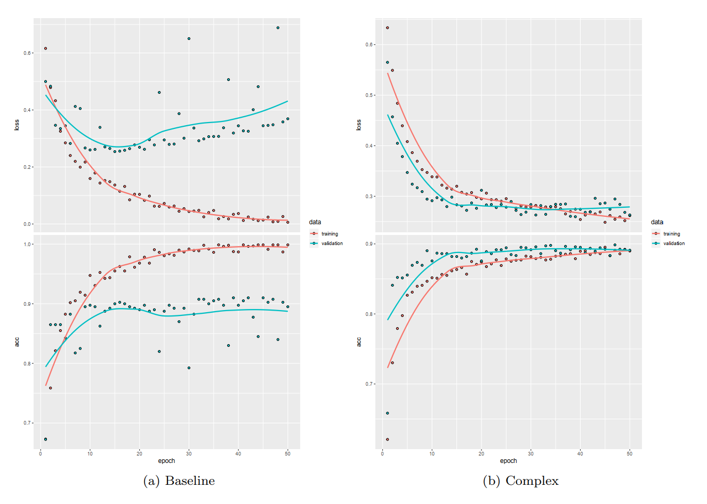

# Neural-Network-Feature-Extraction
Image Recognition using a convolutional base from VGG-16, extracting features from final layers as input for LASSO and Random Forest algorithms. 

> Authors: Emil Westin, Hongru Zhai, Christoffer Eriksson (2020)

## Objective 

- Find the best neural network on top of a pretrained convolutional base (VGG 16).
- Investigate the possibility for some ML models to outperform NN, based on its own generated features.
- In our case we will try doing this with a binary image classification problem.
- We tried to classify images of people as Male or Female.

## Data

- 202 599 images
- 40 binary attributes, e.g. male, glasses, beard.
- We used 8000 images, 1 binary class (male)
- 1600 as training data, 400 as validation data and 6000 as test data

## Method

Based on our classification task we used:
- Loss function: Binary crossentropy
- Optimizer: RMSPROP
- Activation function of the last layer: Sigmoid

- Baseline NN model: one dense layer of 20 units

- Final NN model:

-  Trained different LASSO- and random forest models for
various numbers of features extracted by using 10-fold
cross validation

## Loss and Accuracy levels

## Results

## Discussion

- Using 20 extracted features, our random forest achieved slightly better accuracy on test data than the NN.
- But the results of these models are similar in general, so it’s hard to draw any conclusions.
- The number of features extracted from the NN seem to make little difference in terms of accuracy

- THINGS WE COULD HAVE DONE DIFFERENT:
- Could have used more machine learning methods
- Used different convolutional bases and/or used different data

## References
<a id="1">[1]</a> 
Ziwei Liu, Ping Luo, Xiaogang Wang, and Xiaoou Tang. Deep learning face attributes in the
wild. In Proceedings of International Conference on Computer Vision (ICCV), December 2015.
http://mmlab.ie.cuhk.edu.hk/projects/CelebA.html.

<a id="2">[2]</a> 
Karen Simonyan and Andrew Zisserman. Very Deep Convolutional Networks for Large-Scale
Image Recognition. arXiv e-prints, art. arXiv:1409.1556, Sep 2014

<a id="3">[3]</a> 
J. Deng, W. Dong, R. Socher, L.-J. Li, K. Li, and L. Fei-Fei. ImageNet: A Large-Scale Hierarchical
Image Database. In CVPR09, 2009.

## Appendix
Confusion matrices where the rows represent actual values, the columns represent the predicted values. 0=female, 1=male.

#### Confusion matrix for Neural Network:

#### Confusion matrix for Machine Learning models using features from extracted layers:

